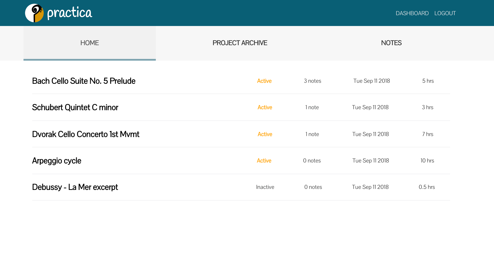

# Practica

Practica is a practice scheduler dedicated to helping musicians keep track of their current projects practice sessions and notes. Whether music is your full-time occupation, or your after-work hobby Practica will be there to help guide you along.

## Demo

[Live Demo](https://boiling-mountain-55806.herokuapp.com/)

### Demo user details:

email: demo@user.com 
password: demouser2018

## Built Using

- Frontend: React, Redux
- Backend: Node.js with Express
- Database: MongoDB with Mongoose

## Features

- Create new projects
- View your practice stats
- Keep track of your notes
- Utilizes GET, POST, PUT and DELETE API endpoints to interact with projects, hourly practice logs, and notes.

## Screenshots

Landing Page

About Practica

Dashboard

Project View

General Notes

Project Archive

